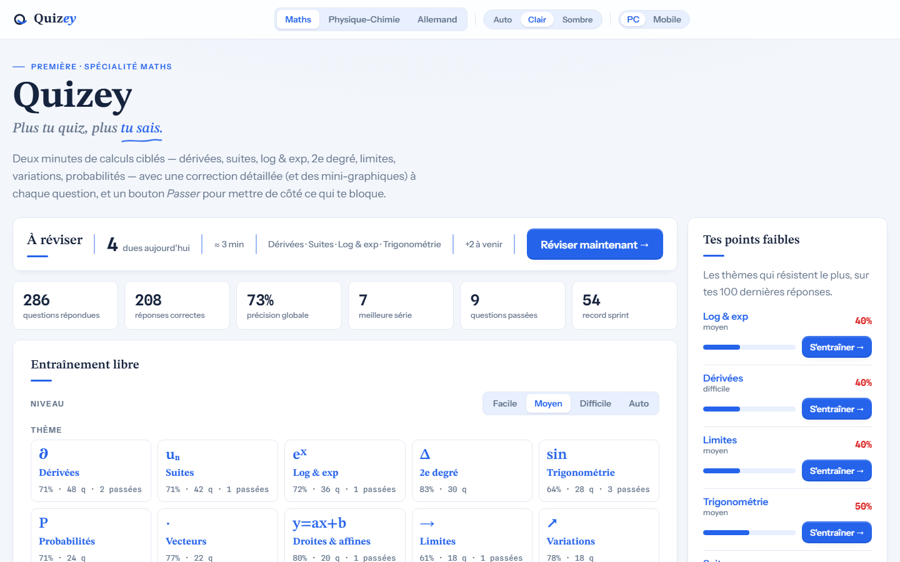
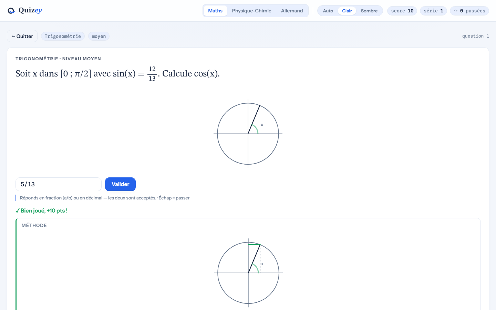
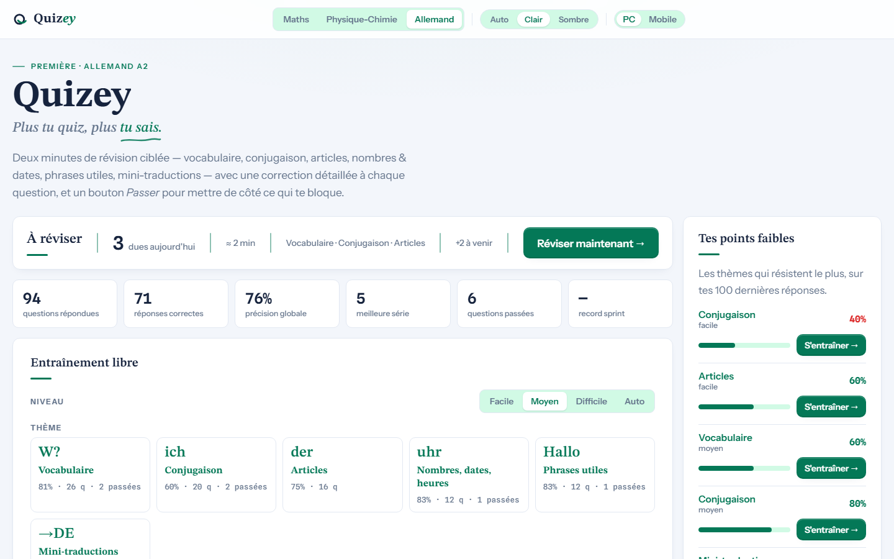

# Quizey

**Plus tu quiz, plus tu sais.**

Quizey est un fichier `.html` autonome pour la révision en classe de Première : mathématiques (spécialité), physique-chimie, allemand et anglais (niveaux A2 à B1). Aucune installation, aucun compte, aucune connexion internet requise : vous l'ouvrez dans votre navigateur et vous vous entraînez.

Chaque question est générée à l'affichage : vous ne voyez donc jamais deux fois les mêmes nombres. Chaque réponse s'accompagne de la méthode de résolution, et non d'un simple indicatif.

Vos progrès, vos points faibles et vos records restent stockés sur votre machine et ne sont jamais transmis. Hors ligne, l'application ne contacte aucun service et utilise les polices du système. En ligne, la seule requête extérieure possible est le chargement des polices d'écriture (Google Fonts), si le navigateur n'en a pas encore — aucune donnée n'y est envoyée.



## Comment s'entraîner

**Entraînement libre** — sélectionnez un thème et un niveau (facile, moyen, difficile — affiché A2, A2+, B1 pour les langues), puis progressez à votre rythme. Le mode **Auto** (difficulté adaptative) ajuste automatiquement le niveau proposé en fonction de vos dernières réponses sur le chapitre, afin de vous servir un exercice exigeant sans être rédhibitoire.

**Sprint 60 s** — les questions s'enchaînent sans interruption, les séries de bonnes réponses s'accumulent et le record est mis à jour. (Maths et physique-chimie : les langues sont 100 % QCM et n'ont pas de sprint.)

**À réviser** — Quizey met en œuvre la méthode d'apprentissage par **répétition espacée** : chaque question ratée est replanifiée selon un intervalle croissant, une bonne réponse la repousse progressivement (demain, puis 3 jours, 7 jours, 2 semaines) tandis qu'une erreur la ramène rapidement. Après cinq réponses correctes consécutives, une question est considérée comme **acquise** et retirée de la liste de révision. La carte d'accueil indique le nombre de révisions **échéues pour la journée**.

Le bouton « Passer » n'est pénalisant à aucun titre : la question concernée est simplement remise en file d'attente.



La correction présente la méthode de résolution, et non uniquement le résultat ; lorsque la question s'y prête, un visuel (courbe, schéma, graphique) accompagne le texte.

Quizey identifie en outre vos **points faibles** (croisement thème × niveau, sur vos 100 dernières réponses) et propose un entraînement ciblé sur chacun.

## Contenu

- **Mathématiques** (spécialité) — 10 thèmes : dérivées, suites, log & exp, 2ᵉ degré, trigonométrie, probabilités, vecteurs, droites & affines, limites, variations
- **Physique-chimie** — 8 thèmes : mécanique & Newton, forces & champs, énergie, quantités de matière, stœchiométrie & état final, cinétique, ondes & lumière, électricité
- **Allemand** — 6 thèmes, 100 % QCM : vocabulaire, conjugaison, articles, nombres · dates · heures, phrases utiles, mini-traductions (niveaux A2 · A2+ · B1)
- **Anglais** — 6 thèmes, 100 % QCM : vocabulaire, verbes & temps, articles & quantifieurs, questions, phrases utiles, mini-traductions (niveaux A2 · A2+ · B1)



## Installation — deux possibilités

**Option 1 · via le terminal.** Dans votre console :

```bash
git clone https://github.com/Cidbzh/Quizey.git
```

Puis double-cliquez sur `Quizey/Quizey.html`.

**Option 2 · via le navigateur.** Accédez à la page [Releases](https://github.com/Cidbzh/Quizey/releases) et téléchargez le fichier (le `.html` direct s'il y figure, sinon « Source code (zip) »). Décompressez, puis double-cliquez sur `Quizey.html`.

Une fois le fichier en votre possession, il vous appartient : sur une clé USB, à la médiathèque, au laboratoire du lycée, sur n'importe quel poste, avec ou sans connexion.

## Licence

MIT — voir le fichier `LICENSE`.
